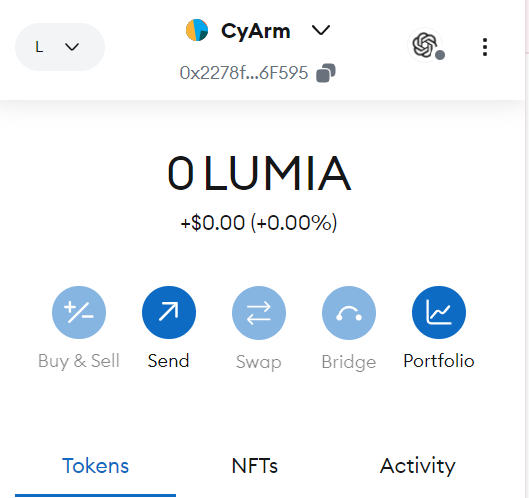
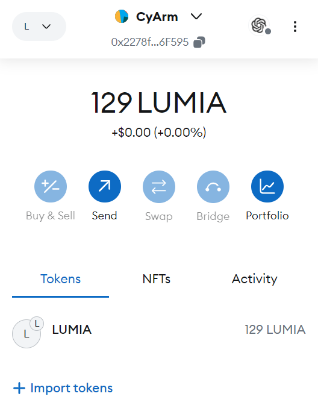
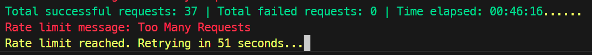

# Lumia Claim Script

This PowerShell script automates sending POST requests to the Lumia testnet faucet API to claim testnet tokens for a **Lumia Testnet Address**. It tracks successful and failed requests, handles rate limiting (status code `429`), and retries after a random delay when rate-limited.

<!-- add 2 images side by side  -->


<p align="center">
  
  
</p>




## Features
- **Automated Requests**: Sends requests to the Lumia Testnet Faucet API to claim tokens.
- **Rate Limiting**: Detects rate limits (status code `429`) and retries after a random delay.
- **Logging**: Displays the total number of successful and failed requests, along with elapsed time.
- **Customizable Parameters**: Modify runtime, API URL, and Lumia testnet address dynamically.

## Parameters
- `runtimeInMinutes` (int): Duration for which the script should run in minutes (default: 120).
- `url` (string): The API URL to which requests are sent (default: Lumia faucet API).
- `address` (string): The Lumia Testnet Address used in the request body (default: `0x2278f2601E956f576d7882E15BBb9cB7dEC6F595`).

## How to Run

### Prerequisites
- PowerShell installed on your system (v5.0 or higher).
- Ensure you have internet access to interact with the Lumia Faucet API.

### Running the Script
1. Download the `lumia_claim.ps1` script file.
2. Open PowerShell and navigate to the directory where the script is located.
3. Run the script with the desired parameters. For example:

   ```powershell
   ./lumia_claim.ps1 -runtimeInMinutes 120 -url "https://testnet-faucet.lumia.org/api/claim" -address "YOUR_LUMIA_TESTNET_ADDRESS"
   ```

   Replace `"YOUR_LUMIA_TESTNET_ADDRESS"` with the Lumia Testnet address to which the tokens should be sent.

### Example Command
```powershell
./lumia_claim.ps1 -runtimeInMinutes 60 -address "0xYourLumiaTestnetAddress"
```

### Output
- The console will display the number of successful and failed requests.
- If a rate limit error occurs, the script will show a countdown for the retry.
- When the script completes, it will show the final tally of successful and failed requests.

### Error Handling
- If any error occurs (such as rate limits), the script will retry automatically after a delay. If you encounter persistent issues, you can reach out for support.

## Event Information

Participate in the Lumia Quest event to earn rewards for claiming tokens via the testnet faucet. For more details, visit [Lumia Quests](https://quests.lumia.org/?referral=0x2278f2601E956f576d7882E15BBb9cB7dEC6F595).

## Reporting Issues
If you encounter any issues with the script, please submit them to our support channel at [t.me/cyarm](https://t.me/cyarm).
